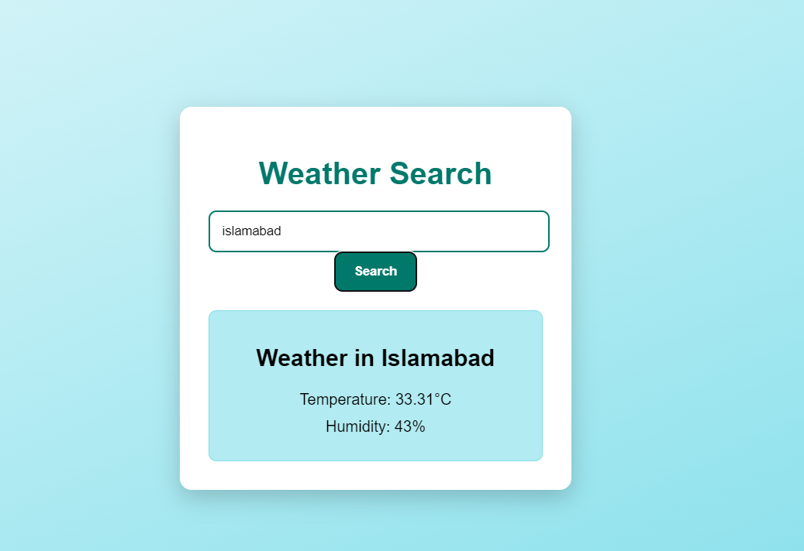

# Weather App

## Overview
The Weather App is a full-stack application that fetches weather data from a public API and stores it in a MySQL database. It provides a simple interface for users to search for weather information by city, displaying real-time weather data such as temperature and humidity.

## Technologies Used
- **Backend**: Node.js, MySQL
- **Frontend**: React.js
- **APIs**: OpenWeatherMap API
- **Other**: `http`, `fs`, and `mysql` core modules for Node.js

## Features
- Fetches weather data from OpenWeatherMap API.
- Stores weather data in a MySQL database.
- Displays weather information (temperature, humidity) for a searched city.
- Caching mechanism to minimize API calls.
- Basic error handling and logging for network or API issues.
- Pre-fetches and displays data for a default city (e.g., London).

## Screenshots



## Getting Started

### Prerequisites
- Node.js (version v20.17.0)
- MySQL Server
- A valid API key from [OpenWeatherMap](https://openweathermap.org/)

### Installation

1. Clone the repository:
   ```bash
   git clone https://github.com/yourusername/weather-app.git
   cd weather-app

2. Install the required packages:
npm install

3. Set up the MySQL database:
- Create a database named weather_db.
- Create a table named weather_logs with the following fields:
CREATE TABLE weather_logs (
  id INT AUTO_INCREMENT PRIMARY KEY,
  city VARCHAR(255),
  temperature DECIMAL(5, 2),
  humidity DECIMAL(5, 2),
  timestamp TIMESTAMP DEFAULT CURRENT_TIMESTAMP
);

4. Configure your database connection in the .env file.

5. Start the Node.js server with this script:
npm run start


Frontend Setup
1. Navigate to the frontend directory (if separate) and install React dependencies:
cd frontend
npm install


2. Start the React app:
npm start

Usage
1. Open the React application in your browser.
2. Enter a city name in the search input field and click the search button.
3. The app will display the current temperature and humidity for the specified city.

Author
Osama Asghar